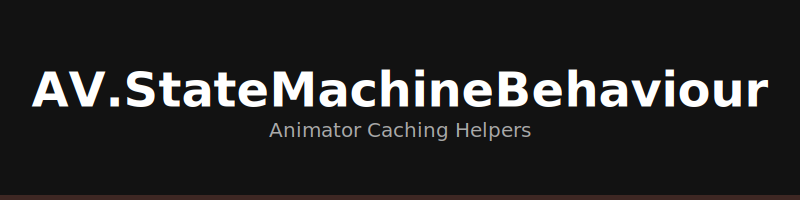

# AV.StateMachineBehaviour

Animator state machine helpers with component caching.

## ✨ Features

- **Combat Integration**: `StateMachineBehaviourPlayerCombatComponent` triggers logic on state exit.
- **Caching**: Uses `AV.Unity.Extend` to cache component references, avoiding `GetComponent` in `OnStateUpdate`.

## 📦 Installation

Install via Unity Package Manager (git URL).

### Dependencies
- **AV.Unity.Extend**

## 🚀 Usage

1. Select an Animator State.
2. Add `StateMachineBehaviourPlayerCombatComponent`.
3. Configure the tag (e.g., "Attack").

## ⚠️ Status

- 🧪 **Tests**: Missing.
- 📘 **Samples**: None.
